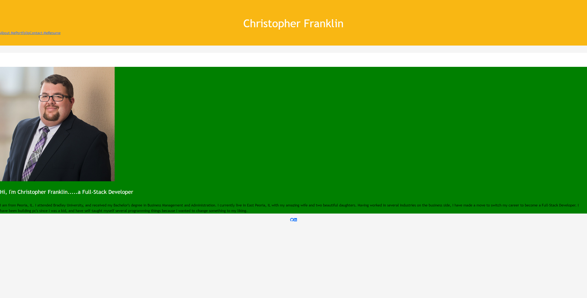

# REACT_Portfolio

[](https://opensource.org/licenses/MIT)

This is a react version of my portfolio.

# Screenshot




## Deployment

GitHub - (https://github.com/Chris-Franklin-1701/REACT_Portfolio)

Deployment - (https://chris-franklin-1701.github.io/REACT_Portfolio/)

## Installation:

``` md git clone to your repo ```


## Contribution:

Please contribute to fork

## License:

MIT
https://opensource.org/licenses/MIT

## Contact:

Christopher Franklin - https://github.com/SilverSSSC/SilverSSSC.github.io - CFrank306@gmail.com
